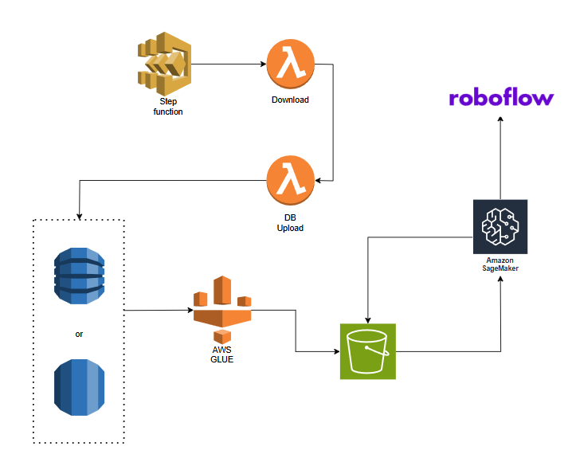

Currently, we do not implement this part of the system as it is easier to run script once for our own data.

Design idea in case we get more sources or images in INaturalist.

**Note:** current implementation of lambda is bound to previous design schema(see previous commits).
